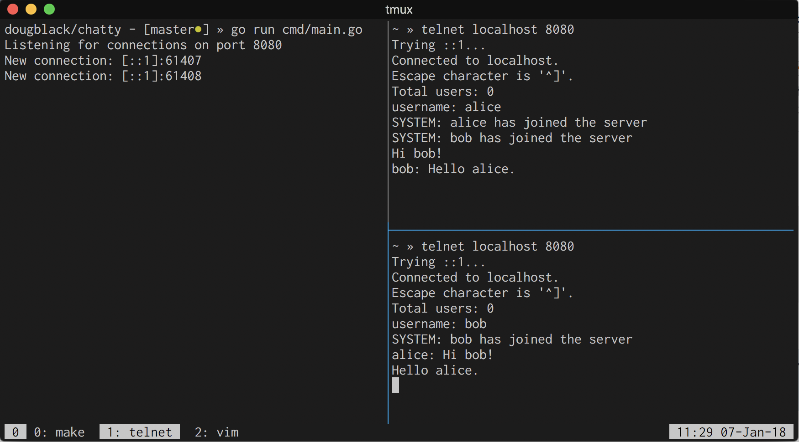

# chatty

A local chat server in Go.

### Example



### Overview

Working on chatty was a nice, small introduction to working with goroutines, channels, and TCP sockets in Go.

Peering at the program structs gives us a good idea how the program is structured.

```go
type Server struct {
	Sessions    map[string]*Session
	Port        int
	Listener    *net.TCPListener
	NewMessages chan *Message
	NewSessions chan *Session
}

type Session struct {
	User string
	Conn *net.TCPConn
}

type Message struct {
	User string
	Body string
}
```

We see that sessions are stored in a map on a `Server`, and new messages and
new sessions are sent over corresponding channels. `Session` objects pair a
username with a `net.TCPConn` and represent an active chat session. Text
entered from any session is wrapped up in a `Message` and pushed to the
`Server.NewMessages` channel. The `Server` will then pull it off the
`Server.NewMessages` channel and broadcast it to all other sessions.
